# Bağımlılık Grafiği

## Mermaid Diyagramı

```mermaid
graph TD
    subgraph "External"
        RSS[RSS Feeds]
        WEB[Web Sites]
        DS[DeepSeek API]
    end

    subgraph "Bot Layer"
        AB[auto-bot.js]
        FETCH[bot/fetcher.ts]
        GEN[bot/generator.ts]
        PUB[bot/publisher.ts]
        PROMPT[bot/prompts.ts]
    end

    subgraph "AI Core"
        AIC[ai/client.ts]
        AICFG[ai/config.ts]
        AIERR[ai/errors.ts]
        DEEP[ai/providers/deepseek.ts]
        PREG[ai/prompts/registry.ts]
    end

    subgraph "Content Engine"
        CS[content/status.ts]
        CLF[content/lifecycle.ts]
        CW[content/workflow.ts]
        CM[content/metadata.ts]
    end

    subgraph "AI Newsroom Agents"
        WRT[agents/writer/]
        SEOA[agents/seo/]
        PUBA[agents/publisher/]
        ED[agents/editor-in-chief/]
    end

    subgraph "Support Services"
        ENT[entity/]
        GEO[geo/]
        IL[internal-links/]
        REC[recommendation/]
        DISC[discover/]
        PUBE[publisher/]
        TREND[trends/]
        TOPIC[topics/]
        SRC[Sources/]
        AUTH[Authors/]
        DIST[distribution/]
        CO[content-opportunities/]
        REV[revenue/]
    end

    subgraph "Lib"
        DB[lib/db.ts]
        SEO[lib/seo.tsx]
        LOG[lib/logger.ts]
        AUTH_LIB[lib/auth.ts]
        VAL[lib/validation.ts]
        UTIL[lib/utils.ts]
        CONST[lib/constants.ts]
    end

    subgraph "Database"
        PRISMA[Prisma Client]
        SQLITE[(SQLite)]
    end

    subgraph "Frontend"
        PUBLIC[Public Pages]
        ADMIN[Admin Pages]
        API[REST API]
    end

    %% Bot → AI
    AB --> FETCH
    AB --> GEN
    AB --> PUB
    FETCH --> RSS
    FETCH --> WEB
    GEN --> DS
    GEN --> AIC
    PUB --> PRISMA

    %% AI Core
    AIC --> DEEP
    AIC --> PREG
    AIC --> AICFG
    AIC --> AIERR
    DEEP --> DS

    %% AI Newsroom
    WRT --> AIC
    SEOA --> SEO
    PUBA --> PRISMA
    PUBA --> CS
    ED --> WRT
    ED --> SEOA

    %% Support → AI Core
    ENT --> AIC

    %% Support → DB
    TOPIC --> PRISMA
    SRC --> PRISMA
    AUTH --> PRISMA

    %% Frontend → Services
    PUBLIC --> SEO
    PUBLIC --> PRISMA
    ADMIN --> PRISMA
    API --> PRISMA
    API --> AUTH_LIB

    %% Lib → DB
    DB --> PRISMA
    PRISMA --> SQLITE
```

---

## Modül Bağımlılık Matrisi

| Modül | AI Core | Content | Entity | GEO | Prisma | SEO Lib |
|-------|---------|---------|--------|-----|--------|---------|
| **auto-bot.js** | ✅ | - | - | - | ✅ | - |
| **bot/index.ts** | ✅ | - | - | - | ✅ | - |
| **bot/fetcher.ts** | - | - | - | - | ✅ | - |
| **bot/generator.ts** | ✅ | - | - | - | - | - |
| **bot/publisher.ts** | - | - | - | - | ✅ | - |
| **agents/writer/** | ✅ | - | - | - | - | - |
| **agents/seo/** | - | - | - | - | - | ✅ |
| **agents/publisher/** | - | ✅ | - | - | ✅ | - |
| **agents/editor-in-chief/** | - | - | - | - | - | - |
| **entity/** | ✅ | - | - | - | - | - |
| **geo/** | - | - | - | - | - | - |
| **topics/** | - | - | - | - | ✅ | - |
| **sources/** | - | - | - | - | ✅ | - |
| **authors/** | - | - | - | - | ✅ | - |

---

## Dış Bağımlılıklar

| Paket | Versiyon | Kullanan |
|-------|----------|----------|
| next | 14.2.35 | Tüm app |
| @prisma/client | 6.19.3 | DB sorguları |
| next-auth | 5.0.0-beta.31 | Auth |
| openai | 6.45.0 | DeepSeek API |
| rss-parser | 3.13.0 | RSS fetch |
| axios | 1.18.1 | Web scraping |
| cheerio | 1.2.0 | HTML parsing |
| bcryptjs | 3.0.3 | Password hash |
| zod | 4.4.3 | Input validation |
| slugify | 1.6.9 | URL slug |
| date-fns | 4.4.0 | Date formatting |
| tailwindcss | - | Styling |
